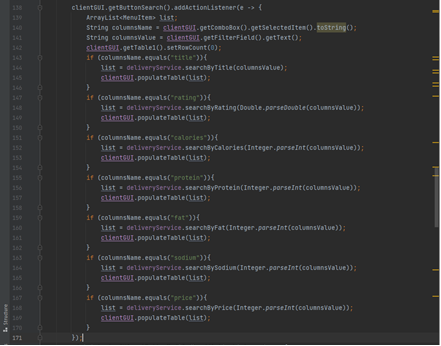

DOCUMENTATIE
TEMA 4

CUPRINS

1.	Obiectivul temei	3
2.	Analiza problemei, modelare, scenarii, cazuri de utilizare	3
3.	Proiectare	3
4.	Implementare	3
5.	Rezultate	3
6.	Concluzii	3
7.	Bibliografie	3

1.	Obiectivul temei 
	Obiectivul principal al temei este realizarea unui sistem de livrare a mancarii pentru o companie de catering, avand acces la aceasta aplicatie administratorii, clienti si angajatii companiei.
	Obiectele secundare au fost atinse prin rezolvarea cerintei in mai multe etape. Acestea vor fi enumerate mai jos si explicate in detaliu in capitolele urmatoare:
- Crearea a trei casute separate de log in functie de rolul persoanei care acceseaza sistemul de catering: client, angajat sau administrator
 

Imaginea 1. Log in system pentru Basic User

- Administratorul poate:
•	importa setul initial de produse din fisierul .csv
•	adauga, sterge si modifica produsele
•	crea noi produse (“produse compuse”), care vor cuprinde produse existente deja in meniu si care vor avea un nume precum daily menu 1
•	genera rapoarte care cuprind detalii despre (1) ora comenzilor, (2) produsele cele mai indragite, (3) clientii care au comandat de mai mult de un anumit numar de ori (numar introdus de administrator) si ale caror comanda a fost mai scumpa decat o anumita valoare si (4) produsele comandate intr-o anumita zi
- Clientul poate:
•	vizualiza lista de produse din meniu
•	cauta produse in functie de cele sapte criterii disponibile: nume, rating, calorii, proteine, grasimi, sodiu si pret
•	crea o comanda care sa contina minim un produs si care va genera un fisier .txt in care vor fi afisate detaliile despre comanda (id-ul comenzii, id-ul clientului, pretul total, data in care a fost plasata comanda si produsele)
- Angajatul:
•	va fi notificat de fiecare cand un client va plasa o noua comanda, astfel incat sa poata pregati livrarea acesteia
Un alt obiectiv este serializarea si deserializarea obiectelor de anumite tipuri. Serializarea este un mecanism
in care un obiect poate fi reprezentat intr-un alt mod si care poate fi citit dupa scrierea sa intr-un fisier. Deserializarea este operatia inversa – prin intermediul ei se efectueaza citirea dintr-un fisier.

2.	Analiza problemei, modelare, scenarii, cazuri de utilizare 
•	Dezvoltarea de use case si scenarii:
Use case: importul setului initial de produse 
Primary Actor: administrator

Main Succes Scenario:
1.	Utilizatorul se logheaza in aplicatie.
2.	Utilizatorul apasa butonul “Import Products”.

Use case: adaugare produse
Primary Actor: administrator
Main Succes Scenario:
1.	Utilizatorul se logheaza in aplicatie.
2.	Utilizatorul completeaza toate campurile corespunzatoare unui produs.
3.	Utilizatorul apasa butonul “Add product”.
In cazul in care nu vor fi completate toate campurile, operatia va esua, dar si in cazul in care campurile
completate nu contin valorile potrivite.

Use case: stergere produse
Primary Actor: administrator
Main Succes Scenario:
1.	Utilizatorul se logheaza in aplicatie.
2.	Utilizatorul completeaza doar campul corespunzator titlului.
3.	Utilizatorul apasa butonul “Delete product”.
In cazul in care nu va fi completat campul potrivit, operatia va esua.

Use case: modificare produse
Primary Actor: administrator
Main Succes Scenario:
1.	Utilizatorul se logheaza in aplicatie.
2.	Utilizatorul completeaza campul destinat titlului si cel putin inca un camp – pot fi facute modificari pentru mai multe coloane simultan.
3.	Utilizatorul apasa butonul “Modify product”.
In cazul in care datele introduse nu corespund tipurilor asteptate, operatia va esua.

Use case: create order
Primary Actor: client
Main Success Scenario:
1.	Utilizatorul se logheaza in aplicatie.
2.	Utilizatorul introduce titlul produsului pe care doreste sa il adauge in comanda si apasa butonul “Add to order”.
3.	In momentul in care clientul nu mai doreste sa adauge alte produse, utilizatorul va apasa butonul “Create order”. Se va crea o comanda, angajatul va primi o notificare despre ea si se va genera automat o factura in format .txt.
In cazul care numele produsului introdus nu exista, acesta nu va fi adaugat, clientul avand voie sa adauge doar din produsele existente in meniu.
3.	Proiectare
•	Proiectarea OOP
Cele mai intalnite concepte OOP sunt mostenirea (in cazul claselor din pachetul users) si polimorfismul (in cazul metodei computeprice()). IDeliveryProcessing si MenuItem sunt cele doua interfete definite in proiect. IDeliveryProcessing contine toate metodele pe care clasa DeliveryProcessing le va implementa. In DeliveryProcessing contine cele mai multe metode din tot proiectul (acestea vor fi prezentate in detaliu in alt capitol). MenuItem este una dintre clasele care a fost folosita pentru includerea Composite Design Pattern (impreuna cu clasele Base Product si Composite Product). Acest design pattern este folosit pentru a permite tratarea obiectelor individuale si a compozitiilor de obiecte in acelasi mod – in cazul nostru pentru un produs de baza sau pentru unul compus, metodele de calculare a atributelor, toate fiind comune, calculandu-se in mod diferit. Al doilea Design Pattern folosita este Observer – acesta este un model de proiectare in care un obiect mentine o lista ai observatorilor sai si ii notifica automat despre orice schimbare de stare – in cazul nostru angajatii vor primi un mesaj cand o comanda va fi plasata.
•	Diagrama UML de clase
Proiectul de fata a fost implementat utilizand cinci pachete: Bussines Layer, Data Layer, Presentation
Layer, Start si Users. 
-	Bussiness Layer contine clasele pentru produse, de baza sau compuse, comenzi, validarea autentificarii, implementarea actiunilor posibile pentru clienti si administratori (interfata IDeliveryServiceProcessing si DeliveryService).
-	Data Layer contine clasele corespunzatoare obiectelor care vor fi serializate si clasa in care se vor implementa metode pentru scrierea in fisiere .txt.
-	Presentation Layer contine clasele folosite pentru interfata grafica – atat partea de structurarea a aplicatiei, cat si interactiunea dintre aplicatie si utilizator.
-	Start contine doar clasa Main de la care va porni programul.
-	Users contine cele trei clase care extind clasa User (tipurile de utilizatori ai acestui program).
	Incepand de la diagrama de clase prezentata in cerinta temei, am adaugat cateva clase pentru:
-	serializare, fiind nevoie de mai multe pentru diferite tipuri de obiecte
-	GUI (am creat patru clase pentru a fi mai usor de gestionat datele care vin de la fiecare tip de utilizator in parte)

•	Testare
	Partea de testare va fi descrisa in mod amanuntit la sectiunea 5. Pentru a verifica corectitudinea programului, vom afisa in cateva fisiere .txt detalii despre comenzile efectuate si despre rapoartele generate de catre administrator.
	O parte importanta a procesarii rezultatelor include stream, assert si lambda expressions. Acestea vor fi prezentate in detaliu in capitolul 4. Streamurile au fost folosite prin metode diferite, cum ar fi map si filter, pentru a produce rezultatul dorit prin vizualizarea inputului din colectii si siruri. Assert este o afirmatie care asigura corectitudinea unei presupuneri care a fost facuta in program – se va intalni des in cazul datelor din tabel pentru a verifica daca au fost bine introduse de catre utilizator. Cand un assert este executat, se crede a fi adevarat. In cazul in care nu este adevarat, va fi aruncata o eroare. Lambda expressions este un bloc de cod care ia parametrii si returneaza o valoare. Acestea sunt similare cu metodele, dar pot fi implementate direct in corpul metodei si nu au nevoie de un nume.
4. Implementare
•	Clasa User
Aceasta clasa cuprinde atributele comune ale tuturor utilizatorilor (pentru clasele Client, Employee si Administrator).
•	Interfata MenuItem
Aceasta interfata contine toate metodele comune pentru clasele BaseProduct si CompositeProduct. Acestea 
trei clase au fost folosite pentru a putea implementa Composite Design Pattern. Diferenta dintre clasele BaseProduct si CompositeProduct este modul de modelare a produselor. Clasa CompositeProduct are metode de adunare a valorilor tuturor atributelor, cum se poate observa in imaginea 2.

Imaginea 7. Exemplu de functie din clasa CompositeProduct

•	Clasa Order
Cuprinde detaliile despre o comanda, incluzand metoda hashCode() care este suprascrisa pentru a putea
compune valoarile pentru Map.
•	Clasa Authentification
Contine metode pentru validarea datelor de inregistrare a utilizatorilor. Aici vor fi deserializate datele 
utilizatorilor.
•	Clasa DeliveryService
Implementeaza interfata IDeliveryService si toate metodele acesteia. Metodele cele mai importante din aceasta clasa sunt:
-	importProducts – pentru a importa produsele din fisierul products.csv
-	metodele de adaugare/stergere/modificare a produselor
Exista o functie separata pentru modificarea fiecarui atribuit in parte. Administratorul poate sa modifice un
produs prin introducerea titlului si a cel putin inca un atribut. La inceput se verifica ca titlul sa nu fie null, iar valorile sa respecte conditiile tipului lor. Se parcurge lista de produse si se schimba valorea atributului acolo unde se regaseste valoarea introdusa de administrator.
 

Imaginea 2. Metode de modificare

-	metodele de cautare a produselor
Exista o functie separata pentru cautarea in functie de atribut. Primul pas este verificarea valorii introduse 
de catre utilizator. Functia returneaza o lista prin intermediul metodei toList() din clasa Collectors. Operatia de filter cauta elementele care se potrivesc cu predicatul trimis ca parametru.
 

Imaginea 3. Metode de cautare

-	metodele folosite pentru plasarea unei comenzi
Clientul are posibilitatea de a adauga cate produse doreste el, nu neaparat distincte, iar mai apoi sa apese
butonul pentru crearea comenzii. Pretul total este calculat si pus intr-o variabila cu ajutorul streamurilor – map returneaza rezultatul dupa aplicarea unei functii pe elementele listei finale de produse care urmeaza a fi comandate. La apasarea butonului de plasare comanda se va genera si un fisier .txt care contine datele comenzii si id-ul de identificare a clientului. In plus, functia setChanged() va anunta ca un obiect a fost schimbat si va trimite o notificare angajatilor pentru a stii ca a fost plasata o noua comanda. Se va goli lista de produse de comandat.
 

Imaginea 4. Metodele folosite pentru crearea unei comenzi

-	metodele de generare a rapoartelor
Prima metoda se foloseste de HashMap-ul comenzilor pentru a verifica ora la care au fost efectuate. In
cazul in care se afla intre orele introduse de catre administrator, vor fi adaugate in lista rezultat.
	A doua metoda se foloseste de inca un HashMap pentru a retine numarul introdus de administrator. Se parcurge lista de comenzi si se calculeaza cu ajutor streamurilor de cate ori a fost comandat acel produs.
 

Imaginea 5. Metodele folosite
pentru generarea primelor doua rapoarte

A treia metoda foloseste un HashMap pentru a retine numarul de comenzi efectuate de fiecare client in
parte si o lista pentru a parcurge fiecare comanda si a afla pretul total. Daca pretul total al unei comenzi este mai mare decat valoarea introdusa de catre administrator si clientul a plasat mai multe comenzi decat valoarea data de catre administrator, clientul va fi adaugat in lista rezultat.
	A patra metoda verifica ziua in care a fost efectuata comanda si o adauga in lista rezultat daca se potriveste cu valoarea introdusa de administrator. Metoda getDay() este folosita in felul urmator:
 

Imaginea 6. Modul in care trebuie 
introduse valorile pentru raportul 4 

 

Imaginea 7. Metodele folosite
pentru generarea ultimelor doua rapoarte

-	metodele folosite pentru crearea unui produs compus
Butonul de Add Composite Product va adauga titlul introdus de catre utilizator intr-o lista pe care o va
utiliza ulterior pentru crearea unui produs compus. Metoda de stringToMenuItem ia elementele din lista de Stringuri si cauta in lista de produse in functie de titlul acestora.
 

Imaginea 8. Metodele folosite
pentru crearea unui Composite Product
•	Clasa FileWriterClass
Curpinde toate metodele necesare pentru a genera cele patru rapoarte si o factura in format .txt. Una dintre
ele este report1(). Parcurge toate comenzile care indeplindesc conditiile cerute si le afiseaza impreuna cu datele necesare.
 

Imaginea 9. Metoda report1()
•	Clasele folosite pentru serializare si deserializare

•	Implementarea interfetei utilizator
Interfata utilizator se deschide cu o casuta in care exista optiunea de log in pentru client, angajat sau
Administrator (se poate observa in Imaginea 1 din capitolul 1). Singurul utilizator care are optiunea de a se inregistra cu un cont nou (introducand un username si o parola) este clientul.
	Dupa selectarea tipului de utilizator vor aparea fie doua casute pentru client si angajat (acestea fiind necesare sa fie deschise deodata pentru ca angajatul sa vada cand primeste o notificare despre o comanda noua), fie o casuta pentru administrator.
 

Imaginea 10. Casutele de log in pentru client, respectiv pentru angajat

	

In cazul in care datele introduse nu sunt corecte pot aparea urmatoarele mesaje de eroare:
 

Imaginea 11. Mesaj de eroare pentru log in

 

Imaginea 12. Mesaj de eroare pentru inregistare
	
	In clasa Controller am adaugat action listeners pentru toate butoanele din interfata utilizator. Voi alege unul dintre ele pe care sa il prezint mai amanuntit: getButtonSearch(). Acest buton poate fi folosit doar de client si are ca rol filtrarea produselor in meniu in functie de optiunea din combo box. Se poate observa in imaginea 6 ca filtrarea si popularea tabelului se face in functie de variabilele columnName si columnsValue.
 

Imaginea 13. Action Listener pentru butonul de cautare

5.	Rezultate
Aplicatia poate fi testata prin intermediul interfetei grafice si prin vizualizarea ulterioara a fisierelor .txt
generate pentru  a se putea observa modificarile dupa fiecare actiune efectuata. Un exemplu poate fi vazut in urmatoarea imagine:
 

Imaginea 14.

6.	Concluzii 
Proiectul de fata cuprinde foarte multe concepte noi. Desi am reusit sa implementez cerintele date, proiectul ar
putea avea parte de dezvoltari, precum:
•	Posibilitatea inregistrarii unor noi angajati, administratori
•	Interfata utilizator sa fie mai bine aranjata pentru a putea fi mai usor de folosit
•	Fisierele .txt sa fie aranjate intr-un mod diferit

7.	Bibliografie 
 
JPanel
https://www.tutorialspoint.com/how-can-we-add-multiple-sub-panels-to-the-main-panel-in-java
Serializare
https://www.javatpoint.com/serialization-in-java
https://www.tutorialspoint.com/java/java_serialization.htm
https://itecnote.com/tecnote/java-how-to-serialize-object-to-csv-file/
Lambda expressions
https://www.w3schools.com/java/java_lambda.asp
Composite Design Pattern
https://www.baeldung.com/java-composite-pattern
Observer Design Pattern
https://www.tutorialspoint.com/design_pattern/observer_pattern.htm

